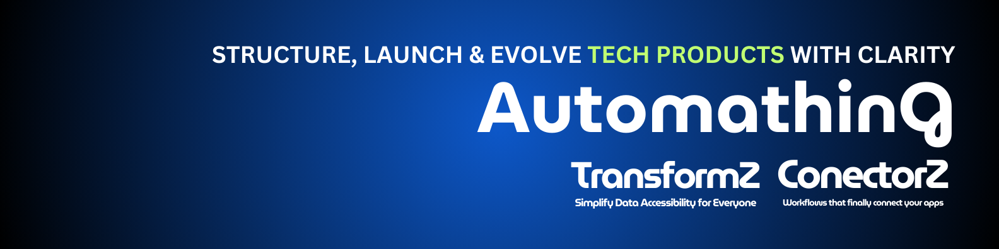
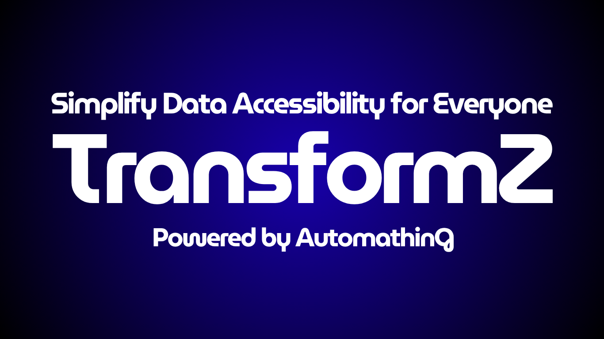

### Hi there 👋
I'm an entrepreneur and Solutions Architect who is constantly learning to better himself while impacting the community by producing technical articles and videos, what describes me the most is my flexibility.

### What I do?
Structure, launch, and evolve your tech products with clarity. We help businesses save time, reduce costs, and scale.

Business First | Product Driven | Software | AI : https://www.automathing.ca

## Products
Our first SaaS product is live, **Simplify Data Accessibility for Everyone** : https://www.transformz.ca

[TransformZ](https://www.transformz.ca) empowers you to ask questions to your data with **AI**, open it in **Excel**, or share it via **auto-generated APIs**; zero coding needed.

### ⭐ Topics Of Interest
➡️ Digital Transformation  
➡️ Enterprise Integration Patterns  
➡️ Solutions Architecture  
➡️ System Integration  
➡️ Programming  
➡️ Automation  
➡️ CRM / ERP  
➡️ Cloud  

<!--
**dassiorleando/dassiorleando** is a ✨ _special_ ✨ repository because its `README.md` (this file) appears on your GitHub profile.

Here are some ideas to get you started:

- 🔭 I’m currently working on ...
- 🌱 I’m currently learning ...
- 👯 I’m looking to collaborate on ...
- 🤔 I’m looking for help with ...
- 💬 Ask me about ...
- 📫 How to reach me: ...
- 😄 Pronouns: ...
- ⚡ Fun fact: ...
-->

<table><tr><td valign="top" width="50%">

##    Latest Videos
 
<!-- YOUTUBE-VIDEOS-LIST:START -->
- [Entreprendre : bénéfices élevés mais c’est risqué !](https://www.youtube.com/shorts/uLGuFFoJvLg)
- [Le vrai problème des entrepreneurs tech, ce n’est pas la motivation, mais la vente !](https://www.youtube.com/shorts/oT7ZMHbH9fM)
- [J’ai démissionné de mon emploi à haut salaire pour créer une entreprise avec 0 clients de départ](https://www.youtube.com/shorts/lNipUyWSUnI)
- [Trouve une coiffeuse Afro au Québec - StyleAfro](https://www.youtube.com/shorts/t8eK9ORj-ik)
- [Client satisfied: new tech projet completed with 5-stars review ⭐️](https://www.youtube.com/shorts/EE0zc6ac2CY)
<!-- YOUTUBE-VIDEOS-LIST:END -->
 
</td><td valign="top" width="50%">

##    Latest Articles
<!-- TECH-POSTS-LIST:START -->
- [Salesforce OAuth 2.0 Web Server Flow in NodeJS](https://dassiorleando.com/salesforce-oauth2-web-server-flow/)
- [Next.js vs Angular: Choosing the Best Framework for Your Front-End Project](https://dassiorleando.com/next-js-vs-angular-choosing-the-best-framework-for-your-front-end-project/)
- [Migrating Resources to AWS CDK Using “CDK Migrate” Command](https://dassiorleando.com/aws-cdk-migrate/)
- [Numerica Ideas’s Tech Writers Leaderboard](https://dassiorleando.com/tech-writers-leaderboard/)
- [Dockerize NodeJS and MySQL with Docker Compose](https://dassiorleando.com/docker-compose-nodejs-mysql/)
<!-- TECH-POSTS-LIST:END -->

</td></tr></table>

**More tech content is available on [My Website](https://dassiorleando.com/blog/) and on [NumericaIdeas's Tech Blog](https://numericaideas.com/blog).**

### 🔥 My Recent Thoughts
<!-- MY-THOUGHTS-LIST:START -->
- [English for Tech Content Creators](https://thoughts.dassiorleando.xyz/english-tech-content-creators/)
- [Succeed in Tech](https://thoughts.dassiorleando.xyz/succeed-in-tech/)
- [Document Your Work Processes](https://thoughts.dassiorleando.xyz/document-your-work-processes/)
<!-- MY-THOUGHTS-LIST:END -->

Read more about my **tech and non-tech** thoughts at [thoughts.dassiorleando.xyz](https://thoughts.dassiorleando.xyz) and subscribe to the newsletter to be kept posted ✅

### 👥 Connect with me
Feel free to follow me on:  

