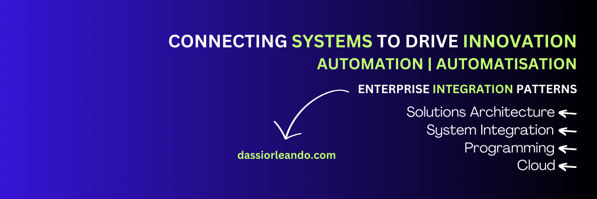

### Hi there 👋
I'm a Solutions Architect who is constantly learning to better himself while impacting the community by producing technical articles and videos, what describes me the most is my flexibility.

### What I do?
Connecting Systems to Drive Innovation ⚡️

### ⭐ Topics Of Interest
➡️ Digital Transformation  
➡️ Enterprise Integration Patterns  
➡️ Solutions Architecture  
➡️ System Integration  
➡️ Programming  
➡️ Automation  
➡️ Apache Airflow  
➡️ Apache Camel  
➡️ Salesforce  
➡️ Cloud  

<!--
**dassiorleando/dassiorleando** is a ✨ _special_ ✨ repository because its `README.md` (this file) appears on your GitHub profile.

Here are some ideas to get you started:

- 🔭 I’m currently working on ...
- 🌱 I’m currently learning ...
- 👯 I’m looking to collaborate on ...
- 🤔 I’m looking for help with ...
- 💬 Ask me about ...
- 📫 How to reach me: ...
- 😄 Pronouns: ...
- ⚡ Fun fact: ...
-->

<table><tr><td valign="top" width="50%">

##    Latest Videos
 
<!-- YOUTUBE-VIDEOS-LIST:START -->
- [Rester compétitif : transformation numérique](https://www.youtube.com/watch?v=i_CQVCcNU0w)
- [Netflix : Transformation Numérique](https://www.youtube.com/watch?v=xFdC2d3pmLU)
- [Les bénéfices de la transformation numérique](https://www.youtube.com/watch?v=aUrqhFW5hrE)
- [Pourquoi la transformation numérique est incontournable en 2025 ?](https://www.youtube.com/watch?v=WzUHkFfN1y4)
- [Ma chaîne YouTube : Ce Que Vous Allez Apprendre et Pourquoi !](https://www.youtube.com/watch?v=SaBONIbfXqo)
<!-- YOUTUBE-VIDEOS-LIST:END -->
 
</td><td valign="top" width="50%">

##    Latest Articles
<!-- TECH-POSTS-LIST:START -->
- [Next.js vs Angular: Choosing the Best Framework for Your Front-End Project](https://numericaideas.com/blog/next-js-vs-angular-choosing-the-best-framework-for-your-front-end-project/)
- [What is Salesforce?](https://numericaideas.com/blog/what-is-salesforce/)
- [Migrating Resources to AWS CDK Using “CDK Migrate” Command](https://numericaideas.com/blog/aws-cdk-migrate/)
- [Numerica Ideas’s Tech Writers Leaderboard](https://numericaideas.com/blog/tech-writers-leaderboard/)
- [Dockerize NodeJS and MySQL with Docker Compose](https://numericaideas.com/blog/docker-compose-nodejs-mysql/)
<!-- TECH-POSTS-LIST:END -->

</td></tr></table>

**More tech content is available on [My Website](https://dassiorleando.com/blog/) and on [NumericaIdeas's Tech Blog](https://numericaideas.com/blog).**

### 🔥 My Recent Thoughts
<!-- MY-THOUGHTS-LIST:START -->
- [English for Tech Content Creators](https://thoughts.dassiorleando.xyz/english-tech-content-creators/)
- [Succeed in Tech](https://thoughts.dassiorleando.xyz/succeed-in-tech/)
- [Document Your Work Processes](https://thoughts.dassiorleando.xyz/document-your-work-processes/)
<!-- MY-THOUGHTS-LIST:END -->

Read more about my **tech and non-tech** thoughts at [thoughts.dassiorleando.xyz](https://thoughts.dassiorleando.xyz) and subscribe to the newsletter to be kept posted ✅

### 👥 Connect with me
Feel free to follow me on:  

