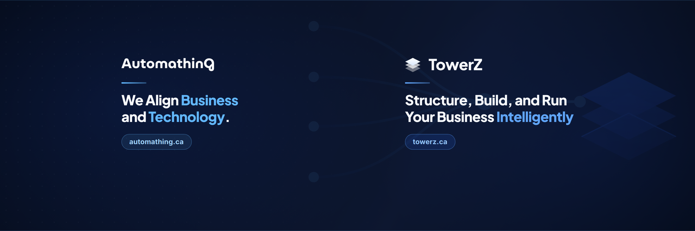

### Hi there 👋
I'm an entrepreneur and Solutions Architect who is constantly learning to better himself while impacting the community by producing technical articles and videos, what describes me the most is my flexibility.

### What I do?
Structure, launch, and evolve your tech products with clarity. We help businesses save time by aligning business and technology seamlessly.

Business First | Software | AI | Cloud : https://www.automathing.ca

## Products
Our flagship product is live, **Structure, Build, and Run Your Business Intelligently** : https://www.towerz.ca

[TowerZ](https://www.towerz.ca) is an intelligent platform that understands your business, clarifies priorities, and turns the right signals into action by connecting analysis, planning, and operations.

### ⭐ Topics Of Interest
➡️ Digital Transformation  
➡️ Enterprise Integration Patterns  
➡️ Solutions Architecture  
➡️ System Integration  
➡️ Programming  
➡️ Automation  
➡️ CRM / ERP  
➡️ Cloud  
➡️ AI  

<!--
**dassiorleando/dassiorleando** is a ✨ _special_ ✨ repository because its `README.md` (this file) appears on your GitHub profile.

Here are some ideas to get you started:

- 🔭 I’m currently working on ...
- 🌱 I’m currently learning ...
- 👯 I’m looking to collaborate on ...
- 🤔 I’m looking for help with ...
- 💬 Ask me about ...
- 📫 How to reach me: ...
- 😄 Pronouns: ...
- ⚡ Fun fact: ...
-->

<table><tr><td valign="top" width="50%">

##    Latest Videos
 
<!-- YOUTUBE-VIDEOS-LIST:START -->
- [L’IA n&#39;est pas un luxe de multinationale, c’est le turbo de la PME](https://www.youtube.com/shorts/jbW9o8-VnXs)
- [IA au Québec : certains secteurs sont presque à 0 % !](https://www.youtube.com/shorts/tTj1aw72Zuo)
- [12,7 % : le chiffre qui cache le vrai problème de l&#39;IA au Québec](https://www.youtube.com/watch?v=49vWnzxXtso)
- [SaaS vs Sur-mesure : le choix stratégique #tech #business #developpement](https://www.youtube.com/shorts/fTRWnpIBPEw)
- [Ta démo IA est inutile en production!](https://www.youtube.com/watch?v=l7oI5ho2_Ec)
<!-- YOUTUBE-VIDEOS-LIST:END -->
 
</td><td valign="top" width="50%">

##    Latest Articles
<!-- TECH-POSTS-LIST:START -->
- [Salesforce OAuth 2.0 Web Server Flow in NodeJS](https://dassiorleando.com/salesforce-oauth2-web-server-flow/)
- [Next.js vs Angular: Choosing the Best Framework for Your Front-End Project](https://dassiorleando.com/next-js-vs-angular-choosing-the-best-framework-for-your-front-end-project/)
- [Migrating Resources to AWS CDK Using “CDK Migrate” Command](https://dassiorleando.com/aws-cdk-migrate/)
- [Numerica Ideas’s Tech Writers Leaderboard](https://dassiorleando.com/tech-writers-leaderboard/)
- [Dockerize NodeJS and MySQL with Docker Compose](https://dassiorleando.com/docker-compose-nodejs-mysql/)
<!-- TECH-POSTS-LIST:END -->

</td></tr></table>

**More tech content is available on [My Website](https://dassiorleando.com/blog/) and on [Automathing's Blog](https://www.automathing.ca/blog).**

### 👥 Connect with me
Feel free to follow me on:  

